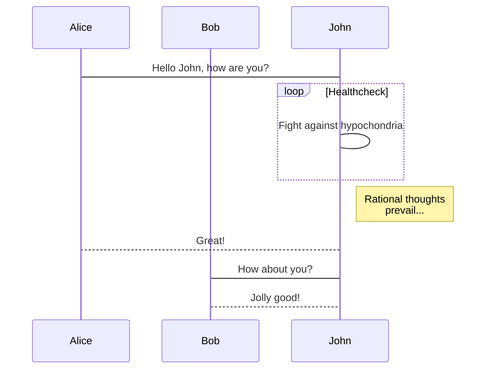

> [!NOTE]
> `sphinxcontrib-mermaid` is actively seeking new maintainers.
> As the original creator, I'm no longer able to dedicate the time and
> attention needed. If you're interested in contributing and helping to
> drive this project forward, please see [this
> issue](https://github.com/mgaitan/sphinxcontrib-mermaid/issues/148).

# sphinxcontrib-mermaid

[](https://github.com/mgaitan/sphinxcontrib-mermaid/actions/workflows/test.yml)
[](https://pypi.org/project/sphinxcontrib-mermaid/)
[](https://libraries.io/pypi/sphinxcontrib-mermaid/)

This extension allows you to embed [Mermaid](https://mermaid.js.org/)
graphs in your documents, including general flowcharts, sequence
diagrams, gantt diagrams and more.

It adds a directive to embed mermaid markup. For example:

```rst
.. mermaid::

    sequenceDiagram
      participant Alice
      participant Bob
      Alice->John: Hello John, how are you?
      loop Healthcheck
          John->John: Fight against hypochondria
      end
      Note right of John: Rational thoughts <br/>prevail...
      John-->Alice: Great!
      John->Bob: How about you?
      Bob-->John: Jolly good!
```

By default, the HTML builder will simply render this as a `div` tag with
`class="mermaid"`, injecting the external javascript, css and
initialization code to make mermaid works.

For other builders (or if `mermaid_output_format` config variable is set
differently), the extension will use
[mermaid-cli](https://github.com/mermaid-js/mermaid-cli) to render as to
a PNG or SVG image, and then used in the proper code.



You can also embed external mermaid files, by giving the file name as an
argument to the directive and no additional content:

```rst
.. mermaid:: path/to/mermaid-gantt-code.mmd
```

As for all file references in Sphinx, if the filename is not absolute,
it is taken as relative to the source directory.

In addition, you can use mermaid to automatically generate a diagram to
show the class inheritance using the directive `autoclasstree`. It
accepts one or more fully qualified names to a class or a module. In the
case of a module, all the class found will be included.

Of course, these objects need to be importable to make its diagram.

If an optional attribute `:full:` is given, it will show the complete
hierarchy of each class.

The option `:namespace: <value>` limits to the base classes that belongs
to this namespace. Meanwhile, the flag `:strict:` only process the
classes that are strictly defined in the given module (ignoring classes
imported from other modules).

For example:

```rst
.. autoclasstree:: sphinx.util.DownloadFiles sphinx.util.ExtensionError
    :full:
```

```{eval-rst}
.. autoclasstree:: sphinx.util.DownloadFiles sphinx.util.ExtensionError
   :full:
```

Or directly the module:

```rst
.. autoclasstree:: sphinx.util
```

```{eval-rst}
.. autoclasstree:: sphinx.util
```

## Installation

You can install it using pip

```bash
pip install sphinxcontrib-mermaid
```

Then add `sphinxcontrib.mermaid` in `extensions` list of your project's
`conf.py`:

```python
extensions = [
    ...,
    'sphinxcontrib.mermaid'
]
```

## Directive options

`sphinxcontrib-mermaid` mermaid diagrams can be configured by `rst`/`md` frontmatter:

```rst
.. mermaid::
   :name: test

   <diagram>
```

````markdown
```mermaid
---
name: test
---
<diagram>
````

- `name`: determines the image's name for HTML output. **NOTE**: mermaid will use this as the `id` of the generated `svg` element, which can be useful for styling with custom css: `#mydiagram > svg { height: 1000px }`
- `alt`: determines the image's alternate text for HTML output. If not given, the alternate text defaults to the mermaid code.
- `align`: determines the image's position. Valid options are `'left'`, `'center'`, `'right'`
- `caption`: can be used to give a caption to the diagram.
- `zoom`: can be used to enable zooming the diagram. For a global config see `mermaid_d3_zoom` below.

<figure class="align-center">

</figure>

- `fullscreen`: can be used to enable fullscreen modal viewing of the diagram. For a global config see `mermaid_fullscreen` below.
- `config`: JSON to pass through to the [mermaid configuration](https://mermaid.js.org/config/configuration.html). **NOTE**: The mermaid documentation uses YAML, but we must use JSON because Markdown processing of frontmatter will interfere.
- `title`: Title to pass through to the [mermaid configuration](https://mermaid.js.org/config/configuration.html)

## Config values

### `mermaid_output_format`

The output format for Mermaid when building HTML files. This must be
either `'raw'` `'png'` or `'svg'`; the default is `'raw'`.
`mermaid-cli` is required if it's not `raw`

### `mermaid_cmd`

The command name with which to invoke `mermaid-cli` program. The
default is `'mmdc'`; you may need to set this to a full path if it's
not in the executable search path. If a string is specified, it is
split using [shlex.split]{.title-ref} to support multi-word commands.
To avoid splitting, a list of strings can be specified. Examples:

```python
mermaid_cmd = 'npx mmdc'
mermeid_cmd = ['npx', '--no-install', 'mmdc']
```

### `mermaid_cmd_shell`

When set to true, the `shell=True` argument will be passed the process
execution command. This allows commands other than binary executables
to be executed on Windows. The default is false.

### `mermaid_params`

For individual parameters, a list of parameters can be added. Refer to
[Examples](https://github.com/mermaid-js/mermaid-cli#usage):

```python
mermaid_params = ['--theme', 'forest', '--width', '600', '--backgroundColor', 'transparent']
```

This will render the mermaid diagram with theme forest, 600px width
and transparent background.

### `mermaid_sequence_config`

Allows overriding the sequence diagram configuration. It could be
useful to increase the width between actors. It **needs to be a json
file** Check options in the [documentation](https://mermaid-js.github.io/mermaid/#/mermaidAPI?id=configuration)

### `mermaid_verbose`

Use the verbose mode when call mermaid-cli, and show its output in the
building process.

### `mermaid_pdfcrop`

If using latex output, it might be useful to crop the pdf just to the
needed space. For this, `pdfcrop` can be used. State binary name to
use this extra function.

### `mermaid_init_config`

Optional override of arguments to `mermaid.initialize()`, passed in as
a JSON. Defaults to `{ "startOnLoad": True}`.

### `mermaid_version`

The version of mermaid that will be used to parse `raw` output in HTML
files. This should match a version available on
[https://www.jsdelivr.com/package/npm/mermaid](https://www.jsdelivr.com/package/npm/mermaid).
The default is `"11.12.1"`.

### `mermaid_use_local`

Optional path to a local installation of `mermaid.esm.min.mjs`. By
default, we will pull from jsdelivr.

### `mermaid_include_elk`

Whether to download and load the ELK JavaScript extensions. Defaults
to False.

### `mermaid_include_zenuml`

Whether to download and load the ZenuML JavaScript extensions.
Defaults to False.

### `mermaid_elk_version`

The version of mermaid ELK renderer that will be used. The default is
`"0.2.0"`.

### `mermaid_zenuml_version`

The version of mermaid ZenuML renderer that will be used. The default
is `"0.2.2"`.

### `mermaid_elk_use_local`

Optional path to a local installation of
`mermaid-layout-elk.esm.min.mjs`. By default, we will pull from
jsdelivr.

### `mermaid_zenuml_use_local`

Optional path to a local installation of `mermaid-zenuml.esm.min.mjs`.
By default, we will pull from jsdelivr.

### `d3_use_local`

Optional path to a local installation of `d3.min.js`. By default, we
will pull from jsdelivr.

### `d3_version`

The version of d3 that will be used to provide zoom functionality on
mermaid graphs. The default is `"7.9.0"`.

### `mermaid_d3_zoom`

Enables zooming in all the generated Mermaid diagrams.

### `mermaid_width`

Sets the default diagram width within its container. Default to 100%.

### `mermaid_height`

Sets the default diagram height within its container. Default to
500px.

### `mermaid_fullscreen`

Enables fullscreen modal viewing for all Mermaid diagrams. When
enabled, a fullscreen button appears in the top-right corner of each
diagram. Clicking it opens the diagram in a fullscreen modal overlay.
The modal can be closed by pressing ESC, clicking outside the diagram,
or clicking the close button. This feature is theme-agnostic and works
with any Sphinx theme.

### `mermaid_fullscreen_button`

Customizes the fullscreen button icon/text. Default is `"⛶"`. You can
use any Unicode character or emoji, for example `"🔍"` or `"⛶"`.

### `mermaid_fullscreen_button_opacity`

Customizes the fullscreen button opacity, to avoid fully obscuring
important chart content. Default is `50` (percent). You can use any
value from 0 to 100. Button becomes fully opaque on hover.

## Markdown support

You can include Mermaid diagrams in your Markdown documents in Sphinx.
You just need to setup the [markdown support in
Sphinx](https://www.sphinx-doc.org/en/master/usage/markdown.html) via
[myst-parser](https://myst-parser.readthedocs.io/) . See a [minimal
configuration from the
tests](https://github.com/mgaitan/sphinxcontrib-mermaid/blob/master/tests/roots/test-markdown/conf.py).

Then in your `.md` documents include a code block as in
reStructuredTexts:

````markdown
```{mermaid}

    sequenceDiagram
      participant Alice
      participant Bob
      Alice->John: Hello John, how are you?
```
````

For GitHub cross-support, you can omit the curly braces and configure
myst to use the [mermaid]{.title-ref} code block as a myst directive.
For example, in \`conf.py\`:

```python
myst_fence_as_directive = ["mermaid"]
```

## Building PDFs on readthedocs.io

In order to have Mermaid diagrams build properly in PDFs generated on
readthedocs.io, you will need a few extra configurations.

1. In your `.readthedocs.yaml` file (which should be in the root of your repository) include a `post-install` command to the Mermaid CLI:

```yaml
        build:
          os: ubuntu-20.04
          tools:
            python: "3.8"
            nodejs: "16"
          jobs:
            post_install:
              - npm install -g @mermaid-js/mermaid-cli
```

Note that if you previously did not have a `.readthedocs.yaml` file,
you will also need to specify all targets you wish to build and other
basic configuration options. A minimal example of a complete file is:

```yaml
# .readthedocs.yaml
# Read the Docs configuration file
# See https://docs.readthedocs.io/en/stable/config-file/v2.html for details
# Required
version: 2
# Set the version of Python and other tools you might need
build:
  os: ubuntu-24.04
  apt_packages:
    - libasound2t64
  tools:
    python: "3.11"
    nodejs: "20"
  jobs:
    post_install:
      - npm install -g @mermaid-js/mermaid-cli
# Build documentation in the docs/ directory with Sphinx
sphinx:
   configuration: docs/conf.py
# If using Sphinx, optionally build your docs in additional formats such as PDF
formats:
  - epub
  - pdf
python:
   install:
   - requirements: docs/requirements.txt
```

2. In your documentation directory add file `puppeteer-config.json` with contents: :

```json
{
 "args": ["--no-sandbox"]
}
```

3. In your documentation `conf.py` file, add: :

```python
mermaid_params = ['-p', 'puppeteer-config.json']
```
